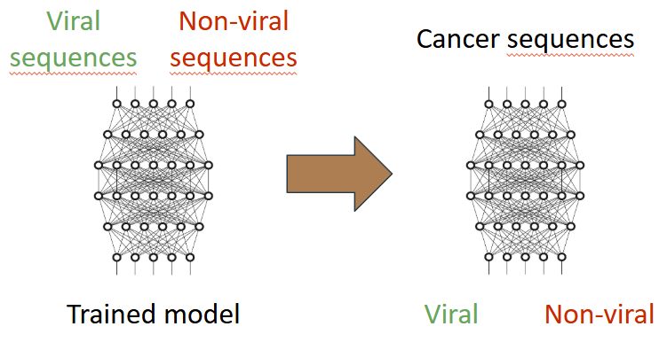

# DeepDoggo: Detecting Viral Reads in Dog Cancer RNA Data Using Deep Learning

DeepDoggo is a deep learning-based method to detect viral sequences in RNA data from canine cancers. This project draws inspiration from the approach described by Elbasir et al., applied to dogs due to restricted access to human cancer data.

The objective is to identify potential viral sequences in canine cancers similar to human cancers, as well as canine-specific cancers like **canine transmissible venereal tumor (CTVT)**.



It contains the follwing features :
- Preprocessing genomic data for compatibility with deep learning models.
- Implementation of a convolutional neural network to classify viral and non-viral sequences.
- Reconstruction and analysis of predictive sequences to assess similarity to known references.

## Table of content
- [DeepDoggo: Detecting Viral Reads in Dog Cancer RNA Data Using Deep Learning](#deepdoggo-detecting-viral-reads-in-dog-cancer-rna-data-using-deep-learning)
  - [Table of content](#table-of-content)
  - [Model Description](#model-description)
  - [Results](#results)
      - [Reconstruction of Predictive Sequences](#reconstruction-of-predictive-sequences)
      - [Specific Observations](#specific-observations)
      - [Limitations of Results](#limitations-of-results)
  - [Prerequisites](#prerequisites)
  - [Data](#data)
  - [Installation and Usage](#installation-and-usage)
  - [Usage](#usage)
    - [Data Preprocessing](#data-preprocessing)
  - [Contributions](#contributions)
  - [References](#references)


## Model Description


To address the size disparity between viral and non-viral datasets, different bp frame windows were used to partially mitigate the imbalance.


The table below summarizes the structure of the deep learning model used:

| Layer                  | Output Shape        | Parameters |
|------------------------|---------------------|------------|
| Conv2D                | (None, 49, 4, 64)   | 192        |
| MaxPooling2D          | (None, 24, 4, 64)   | 0          |
| BatchNormalization    | (None, 24, 4, 64)   | 256        |
| Dropout               | (None, 24, 4, 64)   | 0          |
| Flatten               | (None, 6144)        | 0          |
| Dense                 | (None, 54)          | 3,331,830  |
| Dropout               | (None, 54)          | 0          |
| Dense                 | (None, 1)           | 55         |

## Results

#### Reconstruction of Predictive Sequences
- **Sequence Assembly**: Viral-classified sequences were assembled using SPAdes, yielding 20 contigs of varying lengths (35 to 959 base pairs).
- **BLAST Analysis**: Each contig was compared against a nucleotide sequence database. Results indicated all reconstructed sequences were canine mitochondrial sequences. Key findings include:
  - Sequences primarily derived from **Canis lupus familiaris** (domestic dog).
  - Presence of sequences associated with subspecies like **Canis lupus dingo**.

#### Specific Observations
- Identified sequences included regions specific to the Labrador Retriever breed, suggesting some cancer samples originated from this breed.
- No viral sequences were detected, indicating either an absence of viral sequences in the initial data or limited model performance.

#### Limitations of Results
1. **Data Quality**: The data may have lacked detectable viral sequences.
2. **Model Parameters**: Hyperparameters were not optimized due to time and hardware constraints.
3. **Insufficient Training Depth**: With only 25 epochs, the model may not have fully learned the characteristics of viral sequences.

## Prerequisites
- **Python 3.8+**
- **TensorFlow 2.x**
- **Keras**
- **NumPy**
- Tools for genomic data processing such as **FastQC**, **Bowtie2**, **seqtk**, **bedtools**, and **samtools**.

## Data
The data used for this project includes:
1. **Canine cancer data**: Collected from sources like the **European Nucleotide Archive** and **PubMed**.
2. **Viral database**: Compiled using "Virus-Host DB" to include 74 viruses associated with dogs.

## Installation and Usage
1. Clone this Git repository:
   ```bash
   git clone https://github.com/NoahLacchini/Bioinformatic.git
   cd Bioinformatic
   ```
2. Install dependencies:
   ```bash
   pip install -r requirements.txt
   ```

## Usage
### Data Preprocessing
1. Download and prepare FASTQ files for each cancer type.
2. Convert and align sequences using Bowtie2:
   ```bash
   bowtie2 -x reference -1 input_1.fastq -2 input_2.fastq -S output.sam
   ```
3. Filter unmapped reads and convert them to FASTA format using *fastq_to_fasta.sh*.
4. Split the data using *Splitdata.py*.
5. Utilize the different functions in *DeepLearningFinals.py*.

## Contributions
- **Noah Lacchini**  
- **Ayoub Adib**

## References
- Elbasir et al., "A deep learning approach reveals unexplored landscape of viral expression in cancer" (2023)
- [VirnaTrap Project](https://github.com/AuslanderLab/virnatrap)
